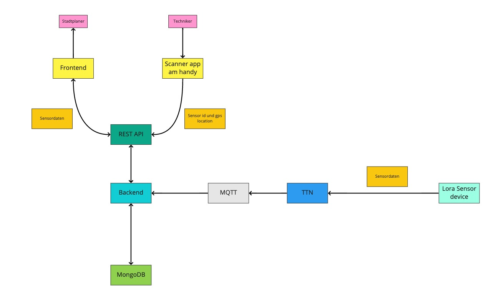

## NOISENSE ##

Noisesne ist ein System zur Darstellung von Livesensordaten mithilfe von LoRa. Die Sensornodes messen die Umgebungslautstärke und übermittlen diese als Dezibel Wert an eine Datenbank. Das Frontend liest deise dann aus der Datenbank aus und zeigt sie auf einer Karte in Markern an welche über Geodaten auf der Karte Plaziert werden.
Das System dient zur erleichterung der Planung von Lärmschutzmaßnahmen und dient als internes Tool den Stadtplanungsbeafutragten.
  
  

 ## Interaktion und Inbetriebnahme ##
Das Backend ist momentan auf dem Server der HfG via Jenkins gehostet und ist bereits zugreifbar unter folgendem link <https://soundsense.srv1.hfgiot.cloud/>

hier können bereits GET anfragen gesendet werden via Avdanced Rest client oder Postman. Unter "/posts" kann über einen GET Request schon der Datenbankinhalt abgefragt werden.

Bisher besteht allerdings noch ein CORS bug welcher es nicht zulässt POST Requests zu senden. dieser wird in im Zuge der Frontendimplementierung noch gefixed.

Über das Frontend kann man auch schon die datenbankinhalte abfragen und als plain text anzeigen lassen. Um es zu starten cloned man sich das Frontend Repo und führt npm run serve aus. Dann gibt man im Browser " http://localhost:'port'/files " ein und man sieht die Inhalte als plain text.

Alle bisherigen verzeichnisse

"/ " das homeverzechnis. Dies zeigt noch die Default Vue Komponenten an

"/about" 'This is an About Page'

"/register" Führt eine POST request aus mit einem zuvor definierten json Datensatz welcher aber durch einen CORS Error Timouted

"/files" Zeigt alle inhalte der Datenbank als plain Text an 

  
  
## Techflow ##

   

  
  
 ## Kommende Features ##

 In den Kommenden versionen Wird noch das Fronend Weiterentwickelt mit funktionierender mapbox und der livedatenazeige.
   
 Die verbindung der Nodes zum TTN funktioniert bereits allerdings werden noch keine daten gesendet. dies wird in kommenden versionen noch hinzugefügt.
   
 Device aktivierung über einen QR Code Scanner welches diesen dann auf der Karte Plaziert.
  
  
 ## Links ##
 Fronend: <https://github.com/IoTSteve/sound-frontend>
  
Ausstellungsseite: <https://ausstellung.hfg-gmuend.de/w-2021/projekte/noisense>

  